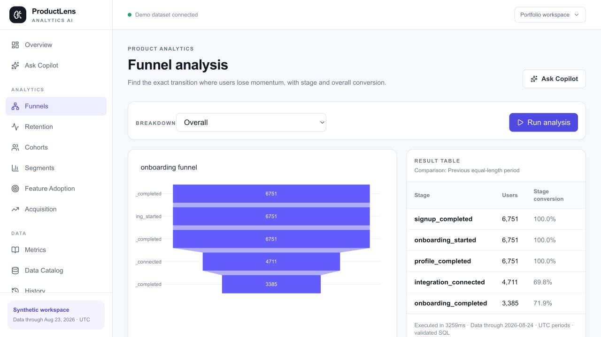

# ProductLens AI

<p align="center">
  <strong>Evidence-first product analytics for teams that want answers they can inspect.</strong><br />
  Turn a business question into a governed metric, validated read-only analysis, evidence-backed insight, and a clear next action.
</p>

<p align="center">
  <a href="https://productlens-web-six.vercel.app">Live demo</a> ·
  <a href="https://productlens-api.vercel.app/docs">API docs</a> ·
  <a href="docs/CASE_STUDY.md">Case study</a> ·
  <a href="docs/ARCHITECTURE.md">Architecture</a>
</p>

<p align="center">
  <a href="https://github.com/Bilal-03/productlens/actions/workflows/ci.yml"></a>
  
  
  
  
</p>

> **Portfolio status:** The P0/P1 analytics foundation, P2 proactive analytics, Phases 39–40, Phase 43, and the bounded P3 milestone are implemented in the repository. The public deployment uses a reproducible synthetic dataset and anonymous demo access. Optional protected tenant workspaces additionally require the Supabase/OIDC, server-side source registry, and connector configuration described in [Deployment](docs/DEPLOYMENT.md).


## What is ProductLens?

ProductLens is a full-stack product analytics workspace for answering questions such as:

> “Why did checkout conversion fall last week, and which customer segment contributed most?”

The application combines a governed semantic layer, deterministic analytics, safe SQL compilation, read-only PostgreSQL execution, controlled visualizations, and an evidence-first Copilot. It is intentionally more inspectable than a generic chatbot or unrestricted text-to-SQL tool.

```text
Question → Plan → Governed metric → Validated SQL → Read-only execution
         → Deterministic analysis → Evidence → Decision → Action
```

### Live links

| Surface | Link | What to explore |
| --- | --- | --- |
| Product workspace | [productlens-web-six.vercel.app](https://productlens-web-six.vercel.app) | Overview, Copilot, Product Pulse, reports, analytics modules, and notebook |
| API | [productlens-api.vercel.app](https://productlens-api.vercel.app) | Health, metadata, analytics, proactive insight, report, and Copilot endpoints |
| OpenAPI docs | [API `/docs`](https://productlens-api.vercel.app/docs) | Interactive FastAPI contract |
| Case study | [docs/CASE_STUDY.md](docs/CASE_STUDY.md) | Flagship incident, production evidence, and screenshots |

## Why it exists

Product teams often wait for an analyst to translate a question into SQL, validate the metric definition, investigate the relevant segments, and turn the result into an action. ProductLens compresses that workflow into one inspectable experience while keeping the parts that must be correct deterministic:

- metric definitions and time semantics;
- denominators, comparisons, and contribution arithmetic;
- SQL safety and database permissions;
- anomaly thresholds and report calculations;
- evidence IDs, sample sizes, caveats, and confidence;
- tenant boundaries, cache namespaces, and history ownership.

The language model can classify and explain a question, but it does not own credentials, invent metric arithmetic, bypass the semantic catalog, or execute arbitrary SQL.

## Product capabilities

| Surface | Product experience | Engineering behind it |
| --- | --- | --- |
| **Overview** | Headline KPIs, comparisons, trends, acquisition, funnel, and retention context | Bounded summary-first loading, parallel reads, dataset-version caching, daily activity rollups, and graceful partial results |
| **Ask Copilot** | Quick Answer and Deep Dive investigations with findings, drivers, evidence, charts, confidence, and follow-up questions | Structured planner, semantic retrieval, governed compilers, SQLGlot validation, read-only execution, and grounded interpretation |
| **Product Pulse** | Explainable anomaly cards with observed vs. baseline values, severity, sample size, segment drivers, and a prefilled Copilot question | 90-day UTC series, 28-day trailing baselines, z-score and percentage gates, minimum-sample guards, and episode collapsing |
| **Weekly Report** | Growth, Activation, Engagement, Retention, Revenue, Anomalies, Drivers, and Recommended Actions | Deterministic report metrics, bounded concurrent execution, safe optional prose, caching, and Markdown export |
| **Analytics studio** | Funnels, retention, cohorts, segments, feature adoption, acquisition, experiments, and advanced analytics | Governed dimensions, explicit cohort windows, contribution analysis, experiment statistics, journeys, stickiness, churn-risk signals, and observed revenue cohorts |
| **Analysis Notebook** | Pin validated investigations, reopen source evidence, and create a deterministic executive summary | Session-scoped server snapshots, idempotent persistence, source ownership checks, and evidence-bound aggregation |
| **Workspace access** | Anonymous demo plus optional email/password sign-in and tenant-aware workspaces | Supabase Auth, OIDC/JWKS verification, group-to-role mapping, server-only source routing, and isolated history/cache/report state |
| **Live updates** | Bounded analytics snapshots that refresh when the source changes | Reconnectable SSE, heartbeats, event IDs, `Last-Event-ID`, fingerprint checks, and automatic browser reconnects |

## Flagship investigation

The deterministic portfolio dataset contains a known checkout incident beginning on **2026-08-18** for **Mobile / Safari / Paid Social**. In the full validation, payment success moves from **86.09%** in the comparison week to **59.45%** after the incident begins. A Deep Dive surfaces that context as measured evidence with a sample size and contribution—not as an unsupported causal claim.

The demo is a useful way to see the complete path:

1. Open the [live workspace](https://productlens-web-six.vercel.app).
2. Use **Ask Copilot** and ask why checkout conversion fell last week.
3. Inspect the comparison, evidence, driver ranking, and investigation trace.
4. Open **Product Pulse** for the anomaly episode and its governed dimensions.
5. Open **Weekly Report** and download the deterministic Markdown export.
6. Save an investigation to the **Analysis Notebook** and generate its evidence-bound summary.


## Architecture at a glance

```text
┌──────────────────────────────────────────────────────────────────────┐
│ Next.js + React Query                                                │
│ Overview · Copilot · Product Pulse · Reports · Notebook · Analytics  │
│ Supabase Auth session · SSE reconnect status · controlled Plotly     │
└───────────────────────────────┬──────────────────────────────────────┘
                                │ typed REST / SSE
┌───────────────────────────────▼──────────────────────────────────────┐
│ FastAPI application                                                   │
│ request validation · RBAC · tenant context · orchestration            │
├──────────────────────────────────────────────────────────────────────┤
│ Semantic registry → planners → SQL compilers → SQLGlot validator      │
│ Deterministic analytics → evidence / reports → optional grounded AI  │
└───────────────────────────────┬──────────────────────────────────────┘
                                │ read-only transactions
┌───────────────────────────────▼──────────────────────────────────────┐
│ PostgreSQL                                                            │
│ analytics views · daily_activity rollup · operational audit/cache     │
│ analytics_reader · app_writer · migration_owner                      │
└──────────────────────────────────────────────────────────────────────┘
```

### Analytics and Copilot flow

```text
Question
  → classify intent and ambiguity
  → resolve a catalogued metric, period, filters, and fixed dimensions
  → compile a bounded PostgreSQL query
  → parse and validate the SQL AST with SQLGlot
  → execute through the least-privilege read-only role
  → calculate comparisons, rates, contributions, and confidence deterministically
  → bind evidence IDs and sample sizes
  → optionally request grounded prose
  → return a typed response and an auditable trace
```

## Trust and safety model

ProductLens treats analytics correctness and data boundaries as first-class product features.

| Boundary | Design |
| --- | --- |
| Semantic governance | Metrics, dimensions, formats, valid filters, tables, PII classification, and time semantics are defined in `backend/app/semantic/`. |
| SQL safety | SQLGlot parses every generated or structured ad-hoc query. Only one bounded read-only statement using allowlisted views/columns is accepted. |
| Database permissions | Analytics uses `analytics_reader`; operational writes use `app_writer`; migrations and seeding use `migration_owner`. These roles are independently enforced by PostgreSQL. |
| Resource controls | Five-second query timeout, 5,000-row cap, request-size limit, bounded report/SSE budgets, and Copilot quotas protect the demo and provider keys. |
| AI boundary | Gemini is the primary provider and Groq is the fallback when configured. Providers are optional; deterministic wording remains available when keys, quotas, grounding, or time budgets fail. |
| Evidence contract | Findings, drivers, recommendations, and report prose must remain tied to returned evidence. Grounding failures fall back safely. |
| Tenant isolation | A verified workspace claim resolves through a server-only registry to a fixed PostgreSQL source. Tenant/source identity participates in sessions, cache keys, reports, history, notebook state, and Copilot execution. |
| Auth boundary | Supabase/OIDC bearer tokens are verified against deployment-configured issuer, audience, expiry, subject, signature, and rotating JWKS keys before group-to-role mapping. |
| Browser boundary | Database URLs, provider keys, OIDC settings, HMAC secrets, and connector credentials never use `NEXT_PUBLIC_*` variables. Tokens are sent in the `Authorization` header, never in a URL. |

### Bounded P3 workspace architecture

```text
Supabase Auth / OIDC provider
  → verified JWT (issuer + audience + exp + sub + signature + JWKS rotation)
  → exact group mapping (admin > analyst > viewer; unmapped groups fail closed)
  → workspace access context
  → server-only TENANT_SOURCE_CONFIG
  → read-only PostgreSQL connector and governed analytics views
  → tenant/source-scoped cache, history, reports, notebook, and Copilot
```

P3 includes six bounded capabilities:

- Supabase Auth email/password sessions with refresh, logout, and anonymous fallback;
- provider-neutral OIDC/JWKS validation and explicit group-based roles;
- source-level tenant-aware analytics isolation;
- one read-only external PostgreSQL connector with contract and health checks;
- bounded, reconnectable SSE analytics updates;
- typed Planner → Analyst → Evidence Copilot orchestration with fixed capabilities.

The orchestration trace exposes stage status, duration, capabilities, handoff count, and fallback metadata. It does not expose hidden chain-of-thought or allow agents to create tools, issue arbitrary SQL, or cross tenant boundaries.

## Governed metric semantics

All timestamps are UTC and period ends are exclusive. Important definitions include:

- **Visitors:** distinct sessions with `landing_page_viewed`.
- **Signups:** distinct users with `signup_completed`.
- **Activation:** signed-up users completing onboarding within seven days.
- **Checkout conversion:** checkout sessions reaching successful payment.
- **Payment success:** successful attempts divided by submitted attempts.
- **Payment failures:** distinct checkout sessions containing `payment_failed`; this is a count metric, not an inferred failure-rate estimate.
- **Revenue:** successful charges and renewals less refunds.
- **Churn:** cancellations divided by subscriptions active at period start.
- **Weekly retention:** activity during days 7–13 after signup.
- **Monthly retention:** activity during days 30–59 after signup.
- **Observed LTV:** net revenue per signed-up user through period end; it is not a forecast.

Immature retention and revenue cohorts are reported as unavailable, never as zero. Feature and churn relationships are described as observed associations, not causal effects.

## Data and reproducibility

The portfolio dataset is synthetic, deterministic, and generated with seed `20260824`. It is anchored to `2026-08-24` so relative periods remain reproducible.

| Entity | Full profile |
| --- | ---: |
| Users | 20,000 |
| Sessions | 120,000 |
| Events | 624,021 |
| Subscriptions | 12,000 |
| Transactions | 25,000 |

The generator includes controlled lifecycle, acquisition, payment, revenue, retention, feature-adoption, experiment, and checkout-incident scenarios. It can produce a fast smoke profile or the full portfolio profile without external data.

## API surface

The API is versioned under `/api/v1` and returns typed Pydantic contracts for the major surfaces.

| Area | Endpoints |
| --- | --- |
| Access and source | `GET /access/context`, `GET /connectors/status`, `GET /health`, `GET /metadata/dataset`, `GET /catalog` |
| Core analytics | `POST /analytics/kpi`, `/compare`, `/segment`, `/trend`, `/funnel`, `/overview`, `/overview/summary`, `/acquisition`, `/retention`, `/cohort`, `/feature-adoption` |
| Proactive analytics | `GET /insights/anomalies`, `GET /insights/pulse` |
| Reports | `GET /reports/weekly`, `GET /reports/weekly/markdown` |
| Experiments and advanced analytics | `GET /experiments`, `GET /experiments/{experiment_key}/analysis`, `GET /analytics/advanced` |
| Copilot and history | `POST /copilot/analyze`, `GET /history`, `GET /history/{query_id}` |
| Notebook | `GET/POST /notebook/insights`, `DELETE /notebook/insights/{insight_id}`, `GET /notebook/summary` |
| Live updates | `GET /stream/analytics` with bounded snapshots, heartbeats, event IDs, and `Last-Event-ID` reconnect support |

## Frontend experience

The Next.js application is responsive across desktop and mobile layouts and includes loading, error, empty, unavailable, and partial-result states.


<table>
  <tr>
    <td></td>
    <td></td>
  </tr>
  <tr>
    <td align="center">Funnel analysis</td>
    <td align="center">Retention analysis</td>
  </tr>
</table>

## Local development

### Prerequisites

- Docker with Compose
- Python 3.12–3.14
- Node.js 22–24 and npm 10+

### Start the local stack

```bash
git clone https://github.com/Bilal-03/productlens.git
cd productlens

cp .env.example .env
python3.12 -m venv backend/.venv
backend/.venv/bin/python -m pip install --upgrade pip
backend/.venv/bin/pip install -e 'backend[dev]'
npm --prefix frontend ci

make db
make migrate
make seed-smoke       # use `make seed` for the full 20k-user profile
```

Start the API and frontend in separate terminals:

```bash
cd backend
.venv/bin/uvicorn app.main:app --reload
```

```bash
cd frontend
npm run dev
```

Open [http://localhost:3000](http://localhost:3000). The anonymous demo works without AI provider keys. Add `GEMINI_API_KEY` and/or `GROQ_API_KEY` to `.env` only when you want live provider interpretation or structured ad-hoc generation; deterministic governed analytics remain available without them.

### Useful commands

Run these from the repository root:

```bash
make test          # backend pytest + frontend Vitest
make lint          # Ruff, mypy, ESLint, and TypeScript
make benchmark     # 58-question offline planner/compiler/chart benchmark
make build         # production frontend build
make preflight     # build plus deployment artifact/environment checks
make integration   # migrated smoke database + PostgreSQL integration tests
make e2e           # desktop/mobile Playwright flows
```

The integration suite requires PostgreSQL. When no database is available, the opt-in database tests are skipped; the offline safety, contract, calculation, and component suites remain runnable.

## Validation and engineering evidence

The repository is evaluated across correctness, safety, performance, product behavior, and deployment readiness:

- `58/58` offline benchmark questions pass across planner intent, metric resolution, dimensions, table coverage, and chart inference.
- The SQL safety corpus covers `160` unsafe cases, including destructive SQL, injection, comments, multi-statements, system catalogs, locking, unsafe functions, and unbounded queries.
- Backend tests cover metric semantics, time ranges, SQL compilation, analytics services, access control, OIDC/JWKS rotation, tenant isolation, connectors, SSE, orchestration, notebook persistence, providers, and performance paths.
- Frontend tests cover auth, API contracts, charts, overview loading, Product Pulse, reports, notebook, advanced analytics, and responsive states.
- CI runs PostgreSQL migrations, smoke seeding, database-backed tests, the benchmark, frontend lint/typecheck/Vitest/build, deployment preflight, and Playwright flows.
- The optimized overview path renders a critical summary before below-the-fold detail queries. On the recorded full-profile fixture, the uncached overview completed in approximately `3.18s` and the cached repeat in approximately `3ms`; these are engineering measurements, not an SLA for every Vercel or database environment.

See [Evaluation](docs/EVALUATION.md) for the test philosophy and [Implementation Status](docs/IMPLEMENTATION_STATUS.md) for the phase-by-phase evidence matrix.

## Production deployment

Production is deliberately split into two Vercel projects:

1. **Backend project:** root `backend/`, FastAPI entry point `api/index.py`.
2. **Frontend project:** root `frontend/`, build command `npm run build`, Node.js 22.x.

Supabase provides PostgreSQL and can optionally provide Auth. Migrations and seeding run from a trusted local or CI environment using the `migration_owner` role; HTTP requests and serverless startup never mutate the database.

For the full deployment handoff, environment variable contract, Supabase role bootstrap, tenant source registry, Auth hook claims, Vercel configuration, and live smoke checklist, see [docs/DEPLOYMENT.md](docs/DEPLOYMENT.md).

The public demo does not require protected workspace configuration. To activate an authenticated tenant, configure all of the following server-side:

- `OIDC_ISSUER_URL`, `OIDC_AUDIENCE`, `OIDC_JWKS_URL`, and exact `OIDC_ROLE_GROUPS`;
- Supabase top-level `workspace_id` and `groups` claims from the Custom Access Token Hook;
- `TENANT_SOURCE_CONFIG` mapping each verified workspace to a source ID and URL environment variable;
- a read-only PostgreSQL URL exposing the governed `analytics` views, including `daily_activity`;
- frontend `NEXT_PUBLIC_SUPABASE_URL` and `NEXT_PUBLIC_SUPABASE_ANON_KEY`.

No database URL, service-role key, provider key, OIDC secret, HMAC secret, or connector credential belongs in the frontend deployment.

## Repository map

```text
productlens/
├── backend/
│   ├── app/ai/             # planner, providers, SQL generation, orchestration
│   ├── app/analytics/      # deterministic services, compilers, proactive analytics
│   ├── app/connectors/     # read-only PostgreSQL connector and contract checks
│   ├── app/database/       # roles, execution, cache, audit, history
│   ├── app/notebook/       # saved analysis snapshots and summaries
│   ├── app/security/       # SQL AST validation, OIDC, access, session hashing
│   ├── app/semantic/       # metrics, dimensions, and schema catalog
│   ├── alembic/            # migrations 0001 through 0006
│   └── tests/              # unit, contract, security, performance, integration tests
├── frontend/
│   ├── app/                # Next.js routes and page composition
│   ├── components/         # dashboard, Copilot, reports, notebook, auth, charts
│   └── lib/                # typed API client, Supabase client, SSE hook, contracts
├── database/               # local role bootstrap and database setup
├── evals/                  # reproducible planner/table/chart benchmark
├── docs/                   # architecture, security, metrics, deployment, case study
└── .github/workflows/      # CI pipeline with database-backed and browser gates
```

## Documentation guide

- [Architecture](docs/ARCHITECTURE.md) — system boundaries, query flow, P2/P3 design, and runtime roles.
- [Security](docs/SECURITY.md) — SQL safety, least privilege, OIDC, RBAC, tenant isolation, and data handling.
- [Metrics](docs/METRICS.md) — canonical definitions, cohort windows, anomaly policy, experiments, and advanced analytics.
- [Dataset](docs/DATASET.md) — deterministic generator, entities, timestamps, and seeded scenarios.
- [Synthetic scenarios](docs/SYNTHETIC_SCENARIOS.md) — known incidents and expected diagnostic signals.
- [Evaluation](docs/EVALUATION.md) — benchmark, test strategy, limitations, and performance evidence.
- [Deployment](docs/DEPLOYMENT.md) — Vercel, Supabase, Auth claims, connector activation, and production smoke checks.
- [Case study](docs/CASE_STUDY.md) — product problem, flagship investigation, production URLs, and screenshots.
- [Implementation status](docs/IMPLEMENTATION_STATUS.md) — phase-by-phase implementation and acceptance evidence.

## Scope and deliberate non-goals

This is a portfolio application using synthetic, observational data. It demonstrates production-minded boundaries, not enterprise readiness or causal inference. In particular:

- no arbitrary user SQL, data mutation, or generated Python;
- no claim of causal conclusions from observational analytics;
- no dynamic user-managed connector UI or secrets manager;
- no enterprise tenant provisioning/RLS rollout or cross-workspace collaboration;
- no permanent real-time infrastructure or streaming ingestion pipeline;
- no autonomous agent swarm, hidden reasoning output, or unbounded tool creation;
- no Slack/email integrations, large connector marketplace, predictive churn model, or forecast LTV in this milestone.

Provider failures, immature cohorts, unavailable sources, and partial query failures are represented explicitly and degrade to safe, deterministic states.

## Built by

[Bilal Choudhary](https://github.com/Bilal-03) · [GitHub repository](https://github.com/Bilal-03/productlens)
