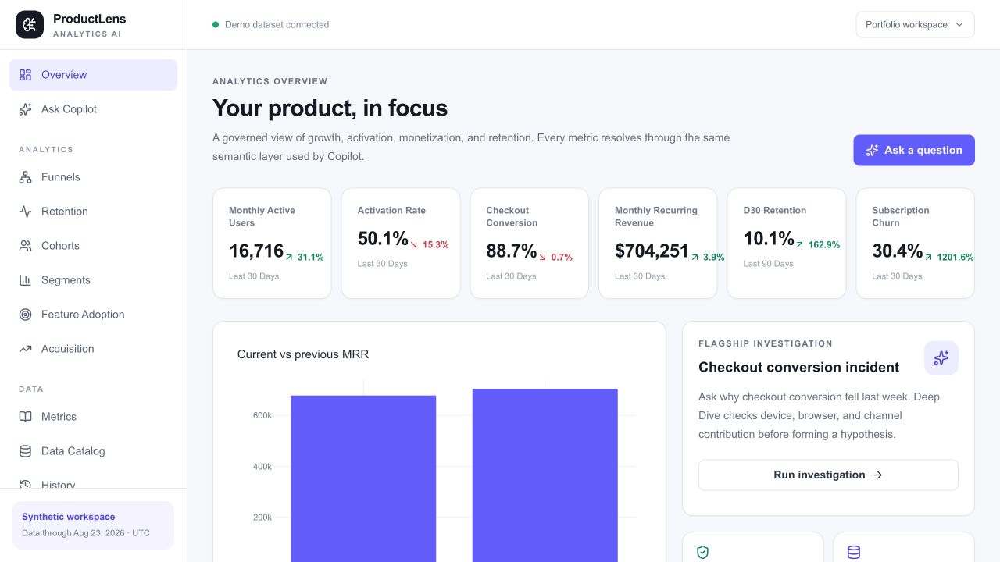
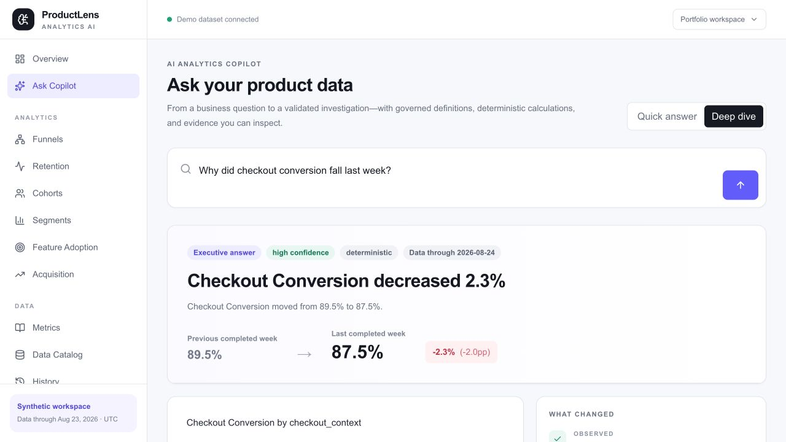
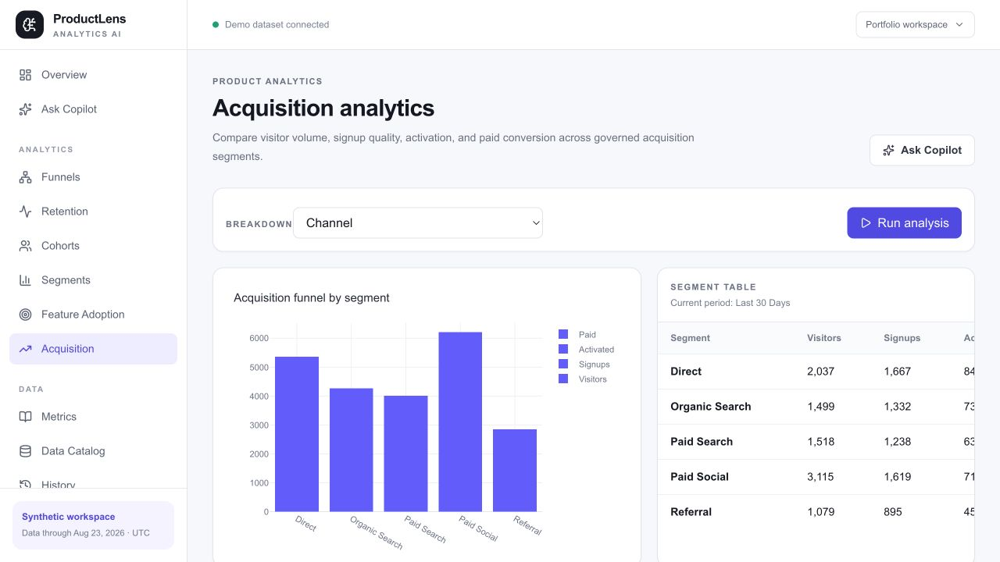
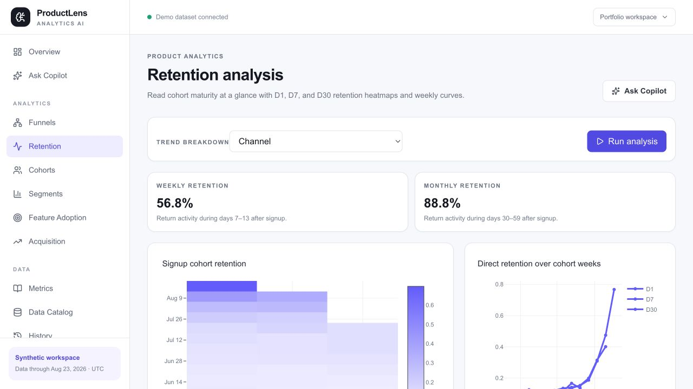

# ProductLens AI case study

## The problem

Product teams commonly have to wait for an analyst to translate a question into SQL, check the metric definition, investigate the segments, and turn the result into an action. ProductLens demonstrates that workflow as one inspectable path:

`Question → Metric → Analysis → Evidence → Insight → Decision → Action`

## The approach

ProductLens uses a centrally governed semantic catalog, trusted SQL compilers for high-value analytics, SQLGlot AST validation, a read-only PostgreSQL role, deterministic calculations, and controlled Plotly specifications. The Copilot is a structured investigation screen rather than an unbounded chat interface. Quick Answer gives the metric and comparison; Deep Dive checks relevant dimensions and ranks measured contributions.

## The flagship investigation

The deterministic generator injects a payment incident beginning 2026-08-18 for Mobile Safari sessions from Paid Social. In the current full validation, payment success moves from 86.09% in the comparison week to 59.45% after the incident begins. Deep Dive surfaces the generated `Mobile / Safari / Paid Social` context with an evidence ID and sample size; no narrative answer is stored in the generator.

## Reproducibility

The portfolio profile uses seed `20260824`, is anchored to dataset-as-of `2026-08-24`, and produces 20,000 users, 120,000 sessions, 624,021 events, 12,000 subscriptions, and 25,000 transactions. The deployed Supabase database measured 199 MB after the final migration and seed, below the 450 MB deployment gate.

## What this demonstrates

- governed metric definitions with explicit UTC periods;
- exact percentage-point versus relative changes;
- additive contribution and rate mix/performance decomposition;
- evidence-bound findings, recommendations, and follow-up questions;
- anonymous-session history without raw IP storage;
- safe degradation when model keys are unavailable, using deterministic wording;
- acquisition visitors → signups → activation → paid-user analysis, weekly/monthly retention windows, and feature-use frequency with D30 association sample sizes.

## Current production URLs

- [ProductLens web](https://productlens-web-six.vercel.app)
- [ProductLens API](https://productlens-api.vercel.app)

The production rollout was completed on 2026-08-26: migration `0002_p0p1_completion`, full seed validation, live endpoint checks, corrected cumulative funnel verification, Copilot/history/security checks, and the evidence below were run against the current deployment.

## Production evidence

## Limitations

The data is synthetic and observational. The application does not establish causality, does not provide authentication or cross-device history, and is not positioned as an enterprise-scale production system. Live provider scoring is intentionally not claimed without a timestamped evaluation artifact. The screenshots above are captured from the current production URLs; the deterministic fallback is shown when provider quota or availability requires it.
